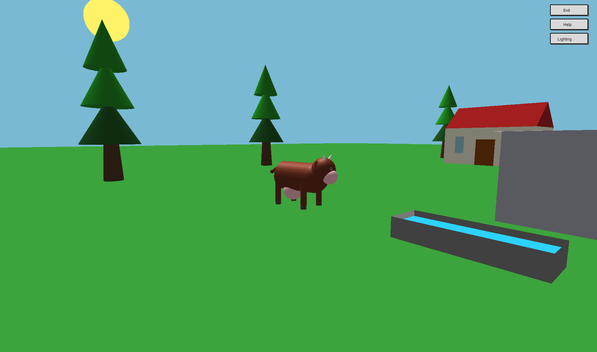

# CG-CowGL
CowGL is my solution for the final project in Computer Graphics (20562) course. It is an interactive rendering of a cow.  
The cow is located in a world which has a few objects in it (trees, house, etc.) and a lighting model.  
The user can control the movement of the cow, camera positioning and the lighting of the scene.
## BUILD INSTRUCTIONS (CLion MacOS)
1. git clone this project
2. Open Project through Clion
3. Run The project
## RUNNING THE PROGRAM
Double-click on the output .exe file or Run in Clion (MacOS).  
Enjoy!    

